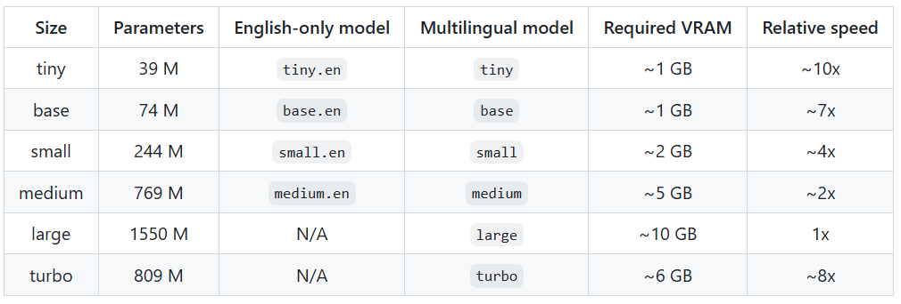
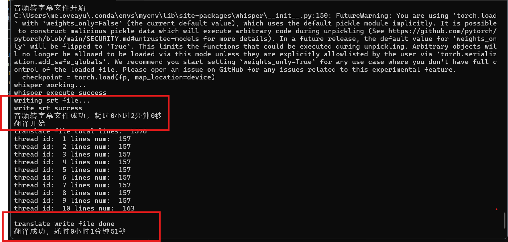
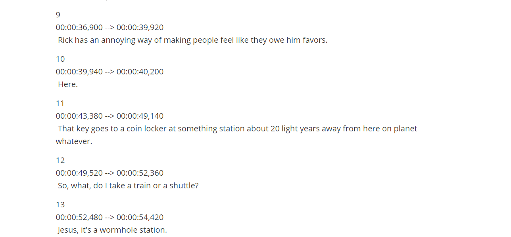
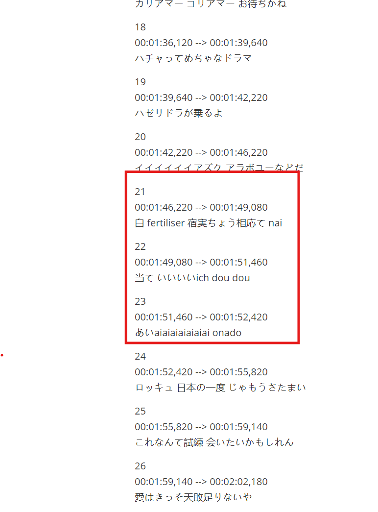

# Openai Whisper内容初探

## 引言

Whisper是由OpenAI开发的一款先进的人工智能语音识别模型，它能够从音频信号中提取转录，无需将视频分成块或批次，从而降低了漏音的风险。Whisper模型以其高准确率和可扩展性在多种数据集上取得了显著的成绩。

## 发展历史

Whisper模型的发展经历了多个版本的迭代，每个版本都在性能和效率上有所提升。从最初的版本到现在的Turbo模型，Whisper在语音识别领域不断进步，提供了更快的处理速度和更好的资源使用效率。

目前最新的模型是2024年10月1日公布的`whisper-large-v3-turbo`模型。

从目前的测试来看，`turbo`从转文字的速度还是从转文字的精度方面是综合表现最好的，一般测试结果来看，模型规模越小，占用的时间和空间资源越小，相对而言精度就不能保证了。不过`turbo`在输入参数相比`large-v3`减半的情况下，能在做到速度相比`base`还快的程度上，翻译的精度和`large-v2`类似。需要的计算资源在中端显卡上基本满足。笔者的测试环境是一台RTX 3060 显存6GB的笔记本，能够顺利完成翻译流程。总的来说比较适合个人研究学习。

## 原理

### 模型架构

Transformer Encoder-Decoder 架构适合处理序列到序列的任务，例如从语音到文本的转换。

### 语音处理

- 使用了680000小时的音频数据，这些数据包含了英文以及其他语言转英文等多种语言。
- 音频数据首先被转换成梅尔频谱图，这是一种将音频信号转换为频域表示的方法，有助于模型捕捉到音频中的关键特征。
- 经过转换的梅尔频谱图随后通过两个卷积层，以进一步提取和加工音频特征。

### 文本处理

- Whisper模型的文本处理涉及到特殊标记（标记文本开始和结束）、文本tokens（文本基本内容）和时间戳tokens（匹配音频中的时间信息和对应文本）三类。
- 特殊标记用于控制文本的开始和结束，而时间戳标记则用于将语音的时间信息与文本进行对齐，确保转录的准确性。

### 编码器和解码器

- 编码器部分接收处理过的音频特征，并将其编码为中间表示，而解码器则负责将这些中间表示解码成文本。
- 编码器和解码器具有相同的宽度和数量的Transformers块，这有助于模型在编码和解码过程中保持一致性。

### 训练过程

- 输入的音频被分割成30秒的小段，然后转换为梅尔频谱图，接着传递到编码器。
- 解码器经过训练以预测相应的文字说明，并与特殊的标记进行混合，这些标记指导单一模型执行语言识别、短语级别的时间戳、多语言语音转录和语音翻译等任务。

### 多任务处理

- Whisper模型能够执行多任务处理，包括语言识别、时间戳标记和多语言转录，这得益于其在大型和多样化的数据集上的训练，而无需针对特定数据集进行微调。

## 效果记录

### 基本表现

Whisper模型在英语文本转换的方面相当出色，转换一个二十分钟左右的视频耗时基本上在两分钟左右。效果如图所示：

在文本转换的结果上精确度也是相当高：

非英文表现上突出一个“能用”，以日语二十分钟左右视频为例，耗时大概4分钟。

输出文本上基本上能做到音对上字，不过实际的正确性就有待商榷了(⊙o⊙)…

### 普遍存在的问题

- 不时会漏语句输出，在规模大的模型中该问题有所改善，但难以避免，社区中有人提出可以将人声音轨分离出来再进行转换，可以考虑一试。但考虑到Whisper本身的训练是没有做分离的，待验证。
- 断句偶尔还有问题。
- 对多人混杂对话的场景处理不是太好，输出的语音基本上会混杂在一起，后续处理就会难以理解。
- 除英语外其他语种的转换输出结果还是有很大的空间。

## 社区中的部分优化性能的项目

- **faster-whisper**：使用CTranslate2重新实现的Whisper模型，更快（据称比官方版本快四倍），占用内存更小。地址：https://github.com/SYSTRAN/faster-whisper
- **whisper.cpp**：C/C++实现的无依赖项版本，支持设备多样，包括树莓派和手机移动端等，可以广泛地搭建离线版本的语音助手。地址：https://github.com/ggerganov/whisper.cpp

- **whisperX**：快速自动语音识别（使用`large-v2`为70倍实时），具有单词级时间戳和说话人分类（基于pyannote-audio）,对支持会议系统等场景有不小的潜力。地址：https://github.com/m-bain/whisperX

## 总结

虽然 Openai 提供线上的Whisper服务调用，但相比持续付出的成本，Whisper还是提供了一个可以在本地搭建输出精度较高的语言转文字服务的方式，在诸如实时会议系统和视频多语言添加字幕上有发展需求的可能，可以搭配社区的部分性能优化的项目拓展一些需求。

## 比较实用的项目

- **VideoLingo**：一站式视频翻译本地化配音工具，一键从Youtube链接下载视频，一键生成高质量字幕，还有配音功能，就是搭建要求比较高，完整的功能要求至少在语音转文字的搭建基础上加上claude-3.5-sonnet大模型支持翻译以及相关的服务商tts（文字转语音）来支持配音。地址：https://github.com/Huanshere/VideoLingo

## 参考内容

- **openai/whisper**：https://github.com/openai/whisper，官方

- **qinL-cdy/auto_ai_subtitle**：https://github.com/qinL-cdy/auto_ai_subtitle 一个基于whisper和translate库实现的简单视频生成翻译字幕的项目，结构简单（总共200行代码左右），脚本操作，可以用于熟悉学习。

